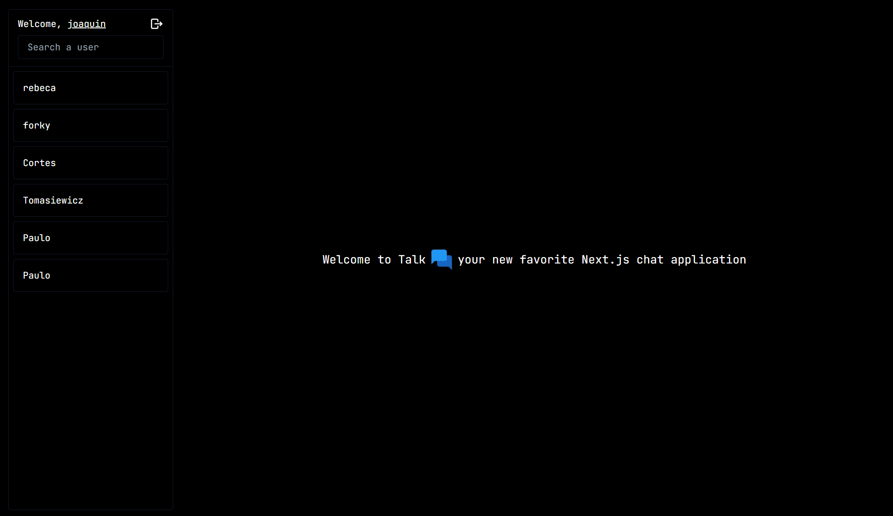

This is a [Next.js](https://nextjs.org/) project bootstrapped with [`create-next-app`](https://github.com/vercel/next.js/tree/canary/packages/create-next-app).

# Talk

Minimalist chat aplicaction. Based on getting users by username.



## Technologies & Dependencies

| Technology                                                                                                                                            | Description                 |
| ----------------------------------------------------------------------------------------------------------------------------------------------------- | --------------------------- |
|                                                             | React framework             |
|                                                      | Programming language        |
| ...>) | Production database         |
|                                                                         | JWT helper                  |
|                                                                  | Hashing & compare passwords |
|                                                                   | Toaster notifications       |
|                                                       | Websocket                   |

## Database Schema

This project utilizes a SQLite database with three main tables: `users`, `conversations`, and `messages`. Below is an explanation of each table, its structure, and visual diagrams.

### Table: `users`

The `users` table stores information about the users of the application.

| Column       | Type      | Constraints                          |
| ------------ | --------- | ------------------------------------ |
| `user_id`    | INTEGER   | PRIMARY KEY, AUTOINCREMENT, NOT NULL |
| `username`   | TEXT      | UNIQUE, NOT NULL                     |
| `fullname`   | TEXT      | NOT NULL                             |
| `password`   | TEXT      | NOT NULL                             |
| `created_at` | TIMESTAMP | DEFAULT CURRENT_TIMESTAMP            |

### Table: `conversations`

The `conversations` table stores information about the users in a conversation.

| Column            | Type    | Constraints                           |
| ----------------- | ------- | ------------------------------------- |
| `conversation_id` | INTEGER | PRIMARY KEY, AUTOINCREMENT, NOT NULL  |
| `user1_id`        | INTEGER | FOREIGN KEY REFERENCES users(user_id) |
| `user2_id`        | INTEGER | FOREIGN KEY REFERENCES users(user_id) |

### Table: `messages`

The `messages` table stores information about the messages exchanged in conversations.

| Column            | Type      | Constraints                                           |
| ----------------- | --------- | ----------------------------------------------------- |
| `message_id`      | INTEGER   | PRIMARY KEY, AUTOINCREMENT, NOT NULL                  |
| `conversation_id` | INTEGER   | FOREIGN KEY REFERENCES conversations(conversation_id) |
| `sender_id`       | INTEGER   | FOREIGN KEY REFERENCES users(user_id)                 |
| `content`         | TEXT      |                                                       |
| `timestamp`       | TIMESTAMP | DEFAULT CURRENT_TIMESTAMP                             |


## How server.js is working?

Create an `http` server with `next()` just like `express()` and then it creates a Socket server

```javascript
const app = next({ dev, hostname, port })
const handler = app.getRequestHandler()
const httpServer = createServer(handler)
const io = new Server(httpServer)
```

Then, this is the main logic of the server side

```javascript
io.on('connection', (socket) => { // this works when a user activates the socket in the client side 
  console.log('a user is connected')

  socket.on('joinRoom', (room) => { // this works when a user open a conversation (room = conversation_id)
    socket.join(room)
    console.log(`User joined room ${room}`)
  })

  socket.on('disconnect', () => {
    console.log('user disconnected')
  })

  socket.on('chat message', ({ room, msg }) => { // this works when the client side send a message
    io.to(room).emit('chat message', msg)
  })
})
```
